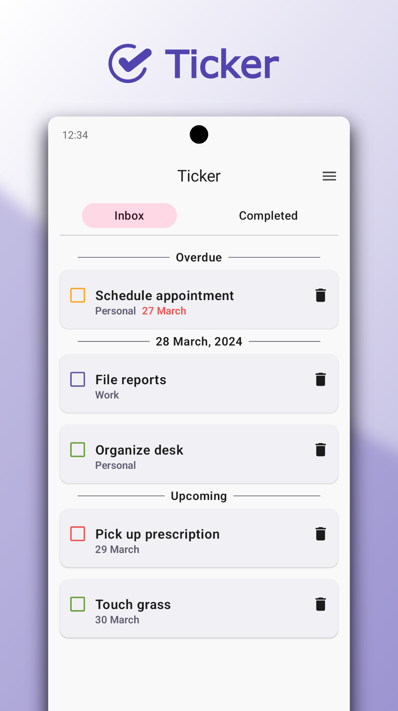
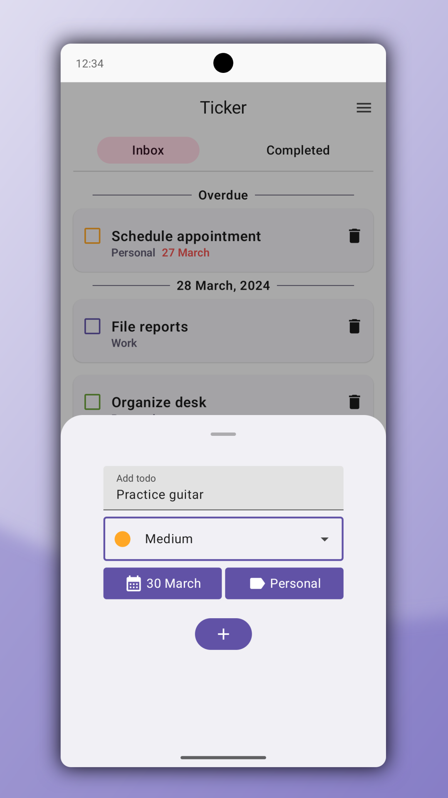
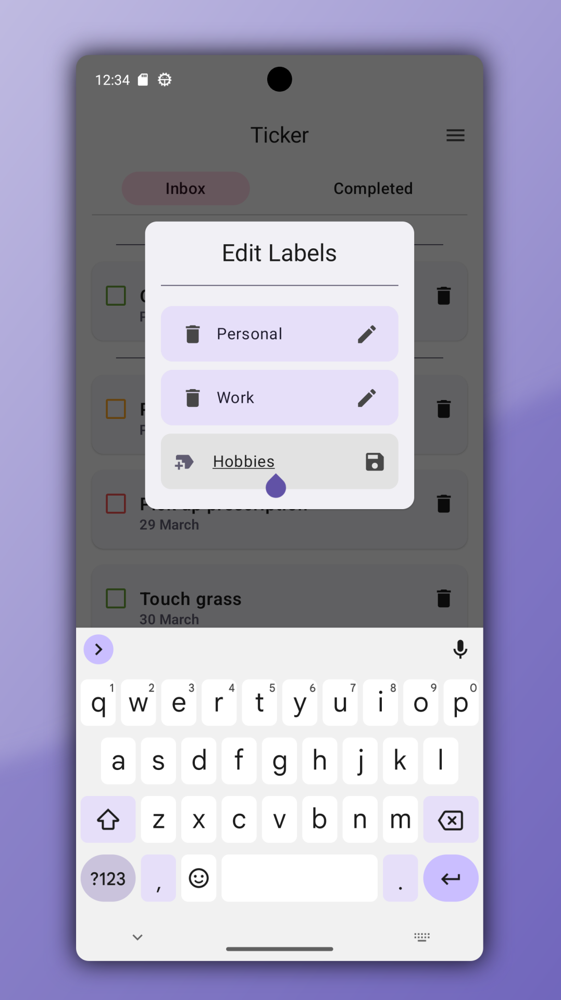
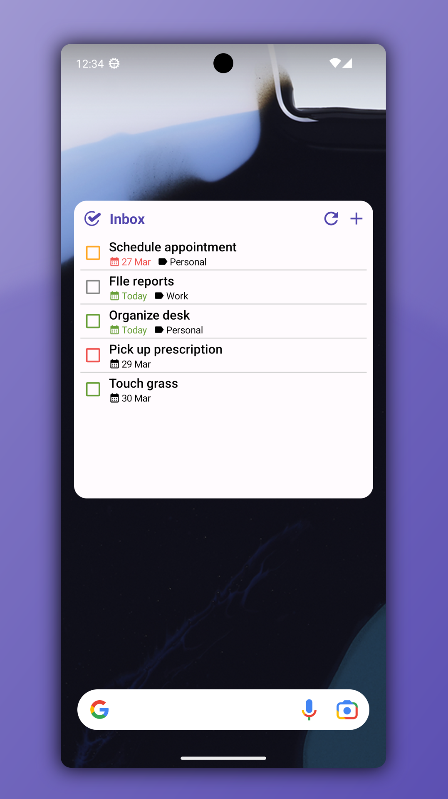

  

 

  A to-do app built for Android using Kotlin and Jetpack Compose.

## Features
- 🏷️ Organize your tasks with customizable labels
- 🚩 Assignable priorities, focus on what matters most
- 🖼️ A home screen widget to keep you on top of your tasks
- 📦 Local storage with Room, no collection of data
- 🎨 Dynamic Theming using Material You
- 🏗️ Built with clean architecture in mind

## Background
Ticker is an app I decided to build to help me learn about proper clean architecture in android app development.
Through building Ticker, I focused on implementing clean architecture patterns to achieve separation of concerns, testability, and maintainability.
  
This project served as a hands-on learning opportunity, allowing me to explore domain layers, data layers, and presentation layers in depth.

## Screenshots

